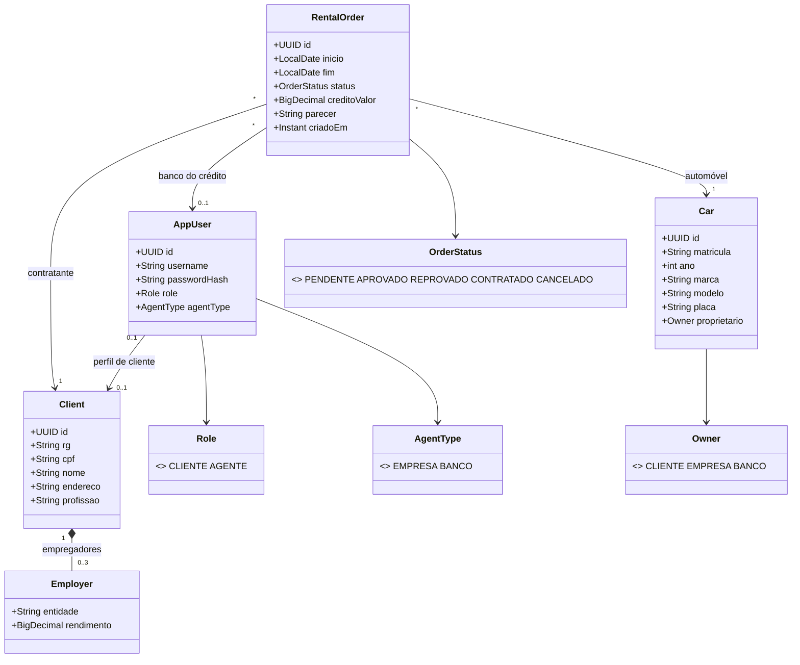

# Diagrama de classes (v1)

```mermaid
classDiagram
    class AppUser {
        +UUID id
        +String username
        +String passwordHash
        +Role role
        +AgentType agentType
    }
    class Client {
        +UUID id
        +String rg
        +String cpf
        +String nome
        +String endereco
        +String profissao
    }
    class Employer {
        +String entidade
        +BigDecimal rendimento
    }
    class Car {
        +UUID id
        +String matricula
        +int ano
        +String marca
        +String modelo
        +String placa
        +Owner proprietario
    }
    class RentalOrder {
        +UUID id
        +LocalDate inicio
        +LocalDate fim
        +OrderStatus status
        +BigDecimal creditoValor
        +String parecer
        +Instant criadoEm
    }
    class Role { <<enumeration>> CLIENTE AGENTE }
    class AgentType { <<enumeration>> EMPRESA BANCO }
    class Owner { <<enumeration>> CLIENTE EMPRESA BANCO }
    class OrderStatus { <<enumeration>> PENDENTE APROVADO REPROVADO CONTRATADO CANCELADO }

    AppUser "0..1" --> "0..1" Client : perfil de cliente
    Client "1" *-- "0..3" Employer : empregadores
    RentalOrder "*" --> "1" Client : contratante
    RentalOrder "*" --> "1" Car : automóvel
    RentalOrder "*" --> "0..1" AppUser : banco do crédito
    AppUser --> Role
    AppUser --> AgentType
    Car --> Owner
    RentalOrder --> OrderStatus
```
